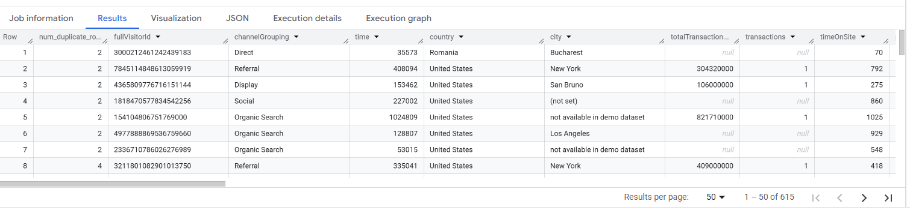
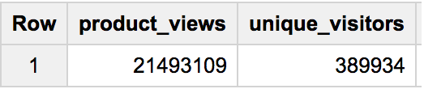
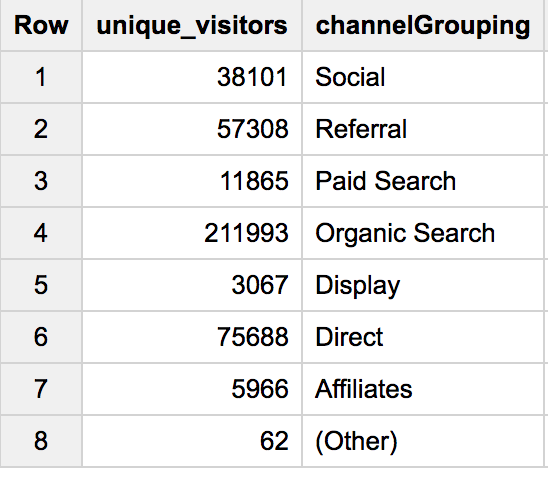
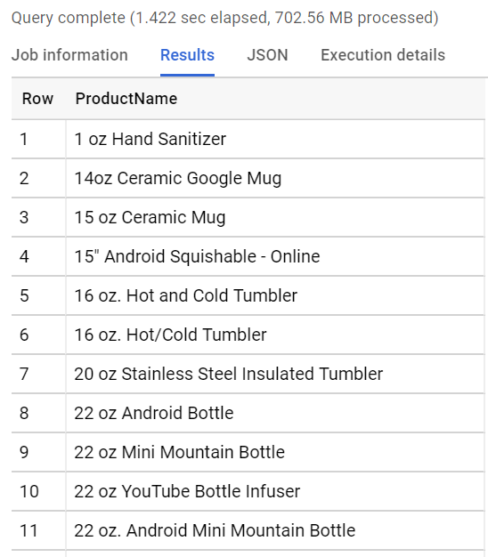
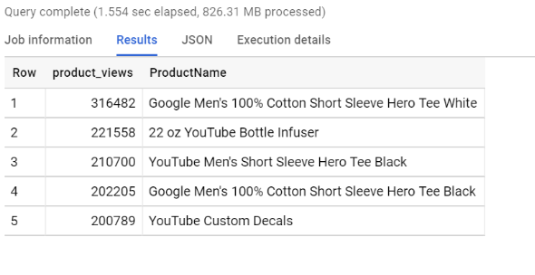
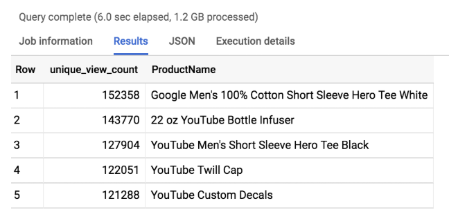
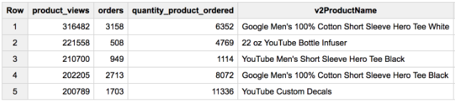

# 🛒 E-commerce Data Analysis with BigQuery

## 📌 Overview
I conducted an end-to-end data analysis project using **Google BigQuery**, a fully managed serverless data warehouse.  
The project focused on an **e-commerce dataset** containing millions of user session records from an online merchandise store.  
Using SQL, I explored the data, identified duplicates, and built queries to extract meaningful business insights about products, users, and traffic sources.

---

## 🎯 Objectives
- Access and explore a large-scale e-commerce dataset in BigQuery  
- Review dataset schema and metadata  
- Identify and handle duplicate rows  
- Write SQL queries to analyze traffic, visitors, and product performance  
- Derive actionable insights and recommendations  

---

## ⚙️ Setup
- Tools: **Google Cloud Platform → BigQuery**
- Languages: **SQL**
- Dataset size: ~21M+ rows (~5.6 GB)  

---

## 🔎 Data Exploration
- Used the **Schema tab** to inspect fields and data types  
- Reviewed **table metadata** to confirm record counts and storage size  
- Previewed rows to understand data distribution  
- Confirmed and removed duplicates using `GROUP BY` and `HAVING` logic  

---

## 🧾 Queries & Insights
### 1. Identify duplicate rows in raw dataset all_sessions_raw
```sql
SELECT COUNT(*) as num_duplicate_rows, * FROM
`data-to-insights.ecommerce.all_sessions_raw`
GROUP BY
fullVisitorId, channelGrouping, time, country, city, totalTransactionRevenue, transactions, timeOnSite, pageviews, sessionQualityDim, date, visitId, type, productRefundAmount, productQuantity, productPrice, productRevenue, productSKU, v2ProductName, v2ProductCategory, productVariant, currencyCode, itemQuantity, itemRevenue, transactionRevenue, transactionId, pageTitle, searchKeyword, pagePathLevel1, eCommerceAction_type, eCommerceAction_step, eCommerceAction_option
HAVING num_duplicate_rows > 1;
```

#### Insight: 615 duplicate rows in the raw dataset

### 2. Identify duplicate rows in dataset all_sessions
```sql
SELECT
fullVisitorId, # the unique visitor ID
visitId, # a visitor can have multiple visits
date, # session date stored as string YYYYMMDD
time, # time of the individual site hit  (can be 0 to many per visitor session)
v2ProductName, # not unique since a product can have variants like Color
productSKU, # unique for each product
type, # a visitor can visit Pages and/or can trigger Events (even at the same time)
eCommerceAction_type, # maps to ‘add to cart', ‘completed checkout'
eCommerceAction_step,
eCommerceAction_option,
  transactionRevenue, # revenue of the order
  transactionId, # unique identifier for revenue bearing transaction
COUNT(*) as row_count
FROM
`data-to-insights.ecommerce.all_sessions`
GROUP BY 1,2,3 ,4, 5, 6, 7, 8, 9, 10,11,12
HAVING row_count > 1 # find duplicates
```

#### Insight: No duplicates in the all_sessions dataset, use this for main analysis

### 3. Unique Visitors and Views
```sql
SELECT
  COUNT(*) AS product_views,
  COUNT(DISTINCT fullVisitorId) AS unique_visitors
FROM `data-to-insights.ecommerce.all_sessions`;
```


#### Insight: High repeat engagement — total views far exceed unique visitors.

### 4. Unique Visitors by Channel
```sql
SELECT
  COUNT(DISTINCT fullVisitorId) AS unique_visitors,
  channelGrouping
FROM `data-to-insights.ecommerce.all_sessions`
GROUP BY channelGrouping
ORDER BY channelGrouping DESC;
```

#### Insight: Organic search and referrals outperform direct traffic in attracting new visitors.

### 5. Distinct Product Names
```sql
SELECT
  v2ProductName AS ProductName
FROM `data-to-insights.ecommerce.all_sessions`
GROUP BY ProductName
ORDER BY ProductName;
```

#### Insight: The catalog contained 633 unique products, primarily apparel, accessories, and branded items.

### 6. Top 5 Most-Viewed Products
```sql
SELECT
  COUNT(*) AS product_views,
  v2ProductName AS ProductName
FROM `data-to-insights.ecommerce.all_sessions`
WHERE type = 'PAGE'
GROUP BY v2ProductName
ORDER BY product_views DESC
LIMIT 5;
```

#### Insight: T-shirts dominate visibility, but this doesn’t always translate to higher conversions.

### 7. Top 5 Products by Unique Views per Visitor
```sql
WITH unique_product_views_by_person AS (
  SELECT
    fullVisitorId,
    v2ProductName AS ProductName
  FROM `data-to-insights.ecommerce.all_sessions`
  WHERE type = 'PAGE'
  GROUP BY fullVisitorId, v2ProductName
)
SELECT
  COUNT(*) AS unique_view_count,
  ProductName
FROM unique_product_views_by_person
GROUP BY ProductName
ORDER BY unique_view_count DESC
LIMIT 5;
```


#### Insight: Certain niche items gain stronger traction per visitor than raw page views suggest.

### 8. Views, Orders, Quantities, and Avg Units per Order
```sql
SELECT
  COUNT(*) AS product_views,
  COUNT(productQuantity) AS orders,
  SUM(productQuantity) AS quantity_product_ordered,
  SUM(productQuantity) / COUNT(productQuantity) AS avg_per_order,
  v2ProductName AS ProductName
FROM `data-to-insights.ecommerce.all_sessions`
WHERE type = 'PAGE'
GROUP BY v2ProductName
ORDER BY product_views DESC
LIMIT 5;
```


---

#### Insight:
- The 22 oz YouTube Bottle Infuser had the highest average order size (~9.4 units/order).
- Apparel drove visibility but not bulk revenue.

---
## 📌 Key Findings

- **633 distinct products** identified in the catalog.  
- **Organic and referral channels** outperform direct traffic in acquiring unique visitors.  
- **High visibility ≠ high sales** — bulk items outperform in per-order revenue efficiency.  
- **Data cleaning (deduplication)** is essential for reliable KPIs.  

---

## 💡 Business Recommendations

1. **Product Strategy**
   - Push **bulk-friendly products** (e.g., Bottle Infuser) with bundle pricing and upsell opportunities.  
   - Use **time-limited promotions** for high-visibility but low-conversion apparel to boost urgency.  

2. **Channel Strategy**
   - Invest more in **SEO and affiliate marketing** since organic/referral drive unique traffic.  
   - Strengthen direct traffic performance with **loyalty programs** and **personalized retargeting**.  

3. **Customer Engagement**
   - Use recommendation engines to highlight **high-order niche products**.  
   - Target **repeat visitors** with personalized cross-sell campaigns.  

4. **Data & Analytics**
   - Maintain **deduplication checks** in pipelines to avoid inflated metrics.  
   - Build real-time **dashboards** comparing traffic efficiency and product conversions.  
